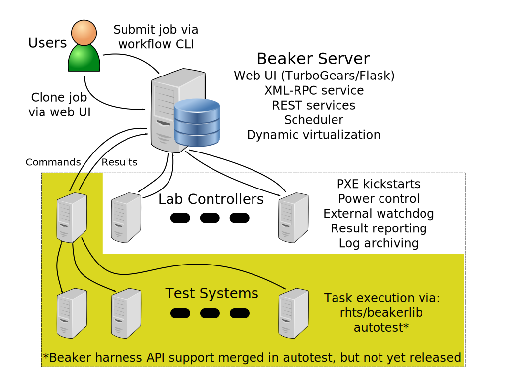
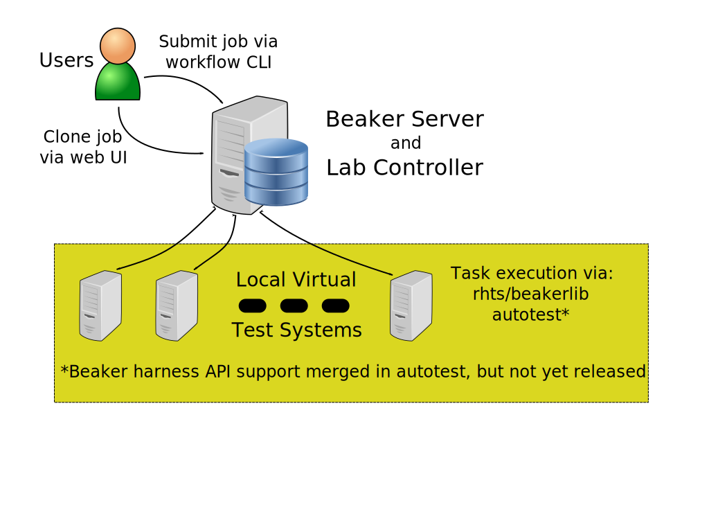
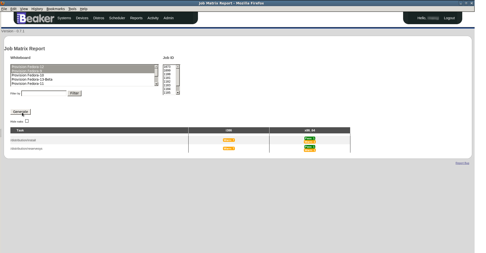

# Scaling Integration Testing with Beaker

----

# Who am I?

## Nick Coghlan (@ncoghlan_dev)

* Red Hat toolsmith since June 2011
* Beaker development lead since October 2012

----

# What is Beaker?

----

# Full stack integration testing system

# Presenter Notes

* Created by Red Hat
* Successor to an internal system called RHTS, which still shows up in a
  few places, mostly the API for the test harness
* Focus is distros based on Anaconda & yum
* First open source release in 2009
* Historically, only limited high level public documentation
* Made adoption difficult outside Red Hat
* Details: http://beaker-project.org/docs-release-0.14/architecture-guide/capabilities.html

----

# Current use cases

# Presenter Notes

* Integration testing of Red Hat software
* Compatibility testing for hardware drivers
* Compatibility testing for new hardware
* General task execution engine (aiming to make it better at this)
* General provisioning system (discouraging this)

----

# Full scale deployment

# Presenter Notes

* Full scale Beaker installation
* Single central server for job submission
* Dispatches each recipe set to one of several lab controllers
* Specifies individual systems for each recipe in the recipe set
* Each lab also needs a DHCP & DNS server, a console logging server, a file
  server for the distro trees and may have a separate log archive server
* For geographically distributed labs, also needs a mirroring system to
  get a local copy of each distro tree to each lab

----

# Minimal deployment

# Presenter Notes

* Minimal Beaker installation
* Central server and lab controller daemons running on one system
* All test systems are libvirt guests on that same server
* Completely self-contained. Can easily add more lab controllers later.
* For development, we go one step further and virtualise the main server
  and lab controller as well

----

# Host requirements

# Presenter Notes

* As an integration testing system, Beaker has a rich query system for
  specifying the kind of system you want to run on
* Basic stuff like name, CPU architecture, which lab its in
* But also stuff determined from an automated inventory scan, like the
  number of processors, the model of the disk controller, details of other
  pieces of hardware, which hypervisor it is running on (if any).
* The things you can query on are currently not well documented.
* We just separated out beaker-system-scan as its own git repo, and are
  likely to expand on the documentation of the values it reports and
  hence can be specified as host requirements

----

# Distro requirements

* The distro query system is much simpler than the one for systems
* Main distinction is between a family like Fedora 20 or Fedora Rawhide
  and a tree, which is a specific build of the distro
* After import, a tree is checked to see if installs on all architectures
  it claims to support
* If all installs work, it is automatically tagged as stable
* If you ask for a family, you'll get the latest stable version by default
* Arbitrary tags are permitted, and can be used to sync trees up with
  releases and other external things

----

# Job structure

# Presenter Notes

* Simplest possible job consists of a single recipe set, containing a
  single recipe which executes a single task which reports a single test
  result. If this is the only kind of job you want to run, Beaker is
  probably overkill.
* Tasks can report results and upload logs. Both are registered with the
  main server, but the logs are stored in the lab (either directly on the
  lab controller or on a separate archive server). Beaker provides several
  predefined tasks for use with RHTS compatible harnesses.
  The "install" task is run by default, and reports on the results of the
  install operation (and uploads various provisioning related logs).
* Recipes are the unit of provisioning - they define the requirements for
  both the kind of host to be provisioned, as well as which distro tree to
  install. They also define the sequence of tasks to be executed on the
  provisioned system. Logs can also be uploaded at the recipe level, most
  notably the console log.
* It's not shown in the diagram, but recipes also support the notion of
  "Guest Recipes". These use the system running the Recipe as a VM host,
  and allows Beaker tasks to be reused for VM testing.
* Recipe sets define multi-host tests. This allows a client and server (or
  more complex configurations) to be provisioned at the same time in the
  same lab, and advanced through their tasks in lock step. The native
  harness can use the lab controller for synchronisation between systems,
  other harnesses may need to provision a driver system that is used for
  coordination.
* Jobs are used for management and reporting, rather than execution. The
  job owner determines the permissions used when findings systems to use,
  as well as who has the ability to cancel or delete the job, or mark the
  results as a valid test. This is useful for running the same test case
  across multiple architectures.

----

# Job workflows

# Presenter Notes

* Beaker represents job definitions as XML (with a Relax-NG schema to
  formally define the format)
* Editing XML by hand isn't fun, and using JSON instead wouldn't magincally
  make it easier
* So, the bkr CLI supports "workflow" plugins
* Designed to easily generate job definitions that follow a particular
  pattern
* Decouples the server infrastructure from the specific way people choose
  to use it
* Some standard workflows are provided by default, but complex use cases
  are often handled better with a custom workflow
* A full XML job definition can be provided directly, bypassing the
  workflow system
* You could probably even define a JSON workflow, that translated from a
  jsonschema defined JSON format to our Relax-NG defined XML format
* Details: http://beaker-project.org/docs/man/bkr.html#workflow-options

----

# Job cloning

# Presenter Notes

* Beaker makes it easy to take any previously executed job and rerun it
* Tweaking an existing XML job definition in the web UI is much easier
  than writing one from scratch

----

# Submission delegates

# Presenter Notes

* A way to grant other users (including automated accounts) the ability
  to submit and manage jobs on your behalf.
* Full audit trail of the delegation, while allowing substantial freedom
  to automate Beaker usage without sharing credentials.

----

# Job matrix report

# Presenter Notes

* Intended to get an overview of the state of different tasks and
  architectures
* Can select directly by Job ID, or by whiteboard setting
* Hard to get a non-proprietary screenshot in our internal instances
* Looks a lot more interesting when you have more architectures

----

# Detailed job results

# Presenter Notes

* Job details page includes details of all recipe sets, recipes and tasks,
  as well as the results reported and links to the archived log files
* these details are also accessible via XML-RPC
* would like to add xUnit and subunit support to Beaker for easier
  integration with external result reporting systems
* would also like to expose this as a REST API rather than the current
  XML-RPC interface
* making both of those more feasible is one of the motivations behind the
  current migration of the main web service from TurboGears to Flask

----

# Watchdog timers

# Presenter Notes

* Integration testing can sometimes cause a system to become
  nonresponsive, due to buggy hardware, software or tests
* Beaker lab controllers have remote power control over systems, so
  can often recover them by rebooting the machine
* This monitoring is another task handled by the lab controller
* There's also a local watchdog in the default test harness that tries
  to kill individual tasks that take longer than expected, without
  killing the entire recipe the way the external watchdog does

----

# Automatic system reservation

# Presenter Notes

* If a job fails, it's possible to automatically reserve the system for
  further investigation
* Currently, this doesn't work if the job is killed by the external
  watchdog, but we have an improved implementation in mind that will
  also handle that case, along with alternative harnesses that can't
  run RHTS compatible tasks.

----

# Current work

# Presenter Notes

* These are some other things we're working on at the moment that I find
  particularly interesting

----

# Dynamic virtualization

# Presenter Notes

* Beaker currently provisions from bare metal, even for recipes that don't
  need it
* This wastes time for short recipes, provides a lot of scope for more
  things to go wrong, and means keeping a lot of commodity x86 hardware
  in the system pool to handle these requests that could just as easily
  run on virtual hardware
* You can add virtual systems to Beaker just like any other machine (and
  set the power control to virsh), but it's a tedious solution
* Dynamic virtualization is about spinning up short-lived VMs to handle
  those recipes that don't need real hardware
* Initial attempt was based on oVirt Engine. It works at small scale, but
  we made some incorrect assumptions about how oVirt works, so Beaker
  doesn't properly detect when the oVirt instance is out of resources
* oVirt also turned out to be a poort fit, as it is optimised for long
  lived high availability virtual machines, rather than the kind of throw
  away VM Beaker wants
* So we've turned our eyes to OpenStack, instead. As the presentation
  blurb said, I'd hoped we would have this working before Flock, but
  other recent changes took longer than I expected.
* The main challenges in supporting OpenStack are mapping from distro
  requirements to image selection in OpenStack, and mapping our current
  kickstart based provisioning to the capabilities of OpenStack Nova based
  provisioning
* Neither of those looks insurmountable, it's just going to take a bit of
  time to work through the details

----

# Improved scheduling algorithms

# Presenter Notes

* Our current scheduler isn't especially clever
* In particular, if a system owner makes their system available to the
  public pool, they don't keep any kind of privileged access - their
  jobs compete on an even footing with other jobs
* This understandably makes people reluctant to share, so the public pool
  may end up saturated, while machines in private pools are idle
* We're currently making many aspects of the permissions and access control
  model more self-service and taking ideas from grid computing schedulers
  (specifically Condor) to help give system owners the ability to share
  their systems for general use, while still being confident they will be
  able to get access to them when they need them.

----

# Other related projects

# Presenter Notes

* Aiming to enhance Beaker through integration with third party components

----

# lshw

# Presenter Notes

* Historically, Beaker was a passive consumer of smolt
* With smolt being retired, we're actively engaging with the lshw upstream
  to ensure lshw can provide all the details we need across all of the
  architectures we support
* We have an independent update cycle though, so beaker-system-scan includes
  a forked copy of lshw
* Any changes we make in our fork will turn into an upstream lshw pull
  request once we have tested it to make sure it works on the systems
  we have access to

----

# Jenkins Beaker Builder Plugin

# Presenter Notes

* persistent buildbots are notorious for getting "dirty"
* the Jenkins Beaker Builder Plugin allows Jenkins to be used for an
  initial check on a single platform, and then spawn a Beaker job for
  more systematic testing on multiple architectures
* Details: https://wiki.jenkins-ci.org/display/JENKINS/Beaker+Builder+Plugin

----

# autotest integration

# Presenter Notes

* for autotest 1.0, the autotest team want to support multiple labs
* rather than adding that directly to autotest, we created a stable
  harness API for Beaker and the ability to request use of an alternative
  harness
* next release of autotest will include native support for running as a test
  harness for Beaker
* Details: https://github.com/autotest/autotest/pull/629

----

# beakerlib

# Presenter Notes

* beah harness API inherited from the Red Hat Test System
* focused on shell scripts for broad compatibility
* beakerlib is a shell library for working with beah and any other
  RHTS compatible harness
* Details: https://fedorahosted.org/beakerlib/

----

# Q & A

Beaker project:

        http://beaker-project.org

Presentation source:

        https://bitbucket.org/ncoghlan/misc/src/default/talks/2013-flock/beaker
